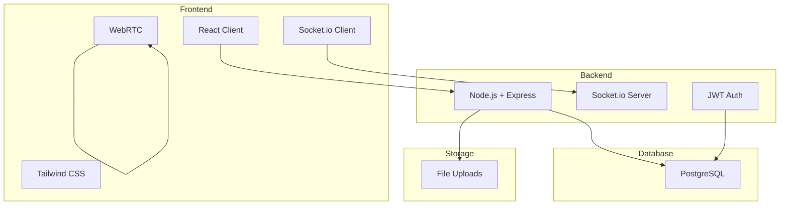

# 🚀 SaudiCord - Self-Hosted Chat Platform

<p align="center">
  
</p>

<p align="center">
  
  
  
  
  
</p>

## 📋 About

**SaudiCord** is a fully-featured, self-hosted chat platform with real-time messaging, voice/video calling, and screen sharing capabilities. Built with modern web technologies and designed with a sleek dark theme with red accents.

### ✨ Features

- **💬 Real-time Messaging** - Instant text messaging with WebSocket support
- **📨 Direct Messages** - Private 1-on-1 messaging with friends
- **👥 Friend System** - Add, remove, and manage friends
- **🎤 Voice Chat** - High-quality voice calling using WebRTC
- **📹 Video Calls** - Face-to-face video communication
- **🖥️ Screen Sharing** - Share your screen in 1080p during calls
- **🏢 Servers & Channels** - Create and manage servers with text/voice channels
- **👤 User Management** - Complete authentication and user profile system
- **🌙 Dark Theme** - Beautiful dark UI with red (#FF0000) accents
- **📱 Responsive Design** - Works on desktop and mobile devices
- **🔒 Secure** - JWT authentication and encrypted communications
- **🐳 Docker Support** - Easy deployment with Docker

## 🏗️ Architecture



## 🚀 Quick Start

### Prerequisites

- Node.js 18+ and npm
- PostgreSQL 15+
- Docker (optional)

### Local Development Setup

1. **Clone the repository**
```bash
git clone https://github.com/yourusername/SaudiCord.git
cd SaudiCord
```

2. **Install dependencies**
```bash
npm run install:all
```

3. **Configure environment variables**
```bash
cd server
cp .env.example .env
# Edit .env with your database credentials
```

4. **Setup PostgreSQL database**
```sql
CREATE DATABASE saudicord;
```

5. **Run the application**
```bash
# Development mode (from root directory)
npm run dev

# This will start:
# - Backend server on http://localhost:10000
# - React client on http://localhost:3000
```

## ☁️ Render.com Deployment (Recommended)

### Quick Deploy with Blueprint

1. **Fork or use this repository**
2. **Deploy on Render:**
   - Go to [Render Dashboard](https://dashboard.render.com)
   - Click "New +" → "Blueprint"
   - Connect GitHub repository: `SirAbody/SaudiCord`
   - Click "Deploy"

The blueprint will automatically create:
- PostgreSQL database
- Backend web service
- Frontend static site
- All required environment variables

### Manual Render Setup
See [RENDER_DEPLOYMENT.md](./RENDER_DEPLOYMENT.md) for detailed instructions.

## 🐳 Docker Deployment

### Using Docker Compose (Recommended)

1. **Configure environment**
```bash
cp server/.env.example server/.env
# Edit server/.env with production values
```

2. **Start services**
```bash
docker-compose up -d
```

This will start:
- PostgreSQL database
- SaudiCord application
- Nginx reverse proxy (optional)

3. **Access the application**
- Open http://localhost:5000 in your browser

### Building Docker Image Manually

```bash
# Build image
docker build -t saudicord .

# Run container
docker run -d \
  -p 5000:5000 \
  -e DB_HOST=your-db-host \
  -e DB_PASSWORD=your-db-password \
  -e JWT_SECRET=your-secret-key \
  saudicord
```

## 🔧 Configuration

### Environment Variables

| Variable | Description | Default |
|----------|-------------|---------|
| `PORT` | Server port | `10000` |
| `DB_HOST` | PostgreSQL host | `localhost` |
| `DB_PORT` | PostgreSQL port | `5432` |
| `DB_NAME` | Database name | `saudicord` |
| `DB_USER` | Database user | `postgres` |
| `DB_PASSWORD` | Database password | Required |
| `JWT_SECRET` | JWT signing secret | Required |
| `CLIENT_URL` | Client URL for CORS | `http://localhost:3000` |

### SSL/HTTPS Setup

For production, configure SSL in `nginx.conf`:

1. Obtain SSL certificates
2. Update nginx.conf with your domain and certificate paths
3. Uncomment the HTTPS server block
4. Restart nginx

## 📱 Usage

### Creating an Account

1. Navigate to `/register`
2. Enter your email, username, and password
3. Click "Create Account"

### Starting a Conversation

1. Login to your account
2. Join or create a server
3. Select a channel
4. Start messaging!

### Voice/Video Calls

1. Click the phone or video icon in a channel
2. Allow microphone/camera permissions
3. Start talking!

### Screen Sharing

1. During a call, click the screen share button
2. Select the window or screen to share
3. Click "Share"

## 🛠️ Tech Stack

### Frontend
- **React 18** - UI framework
- **Tailwind CSS** - Styling
- **Socket.io Client** - Real-time communication
- **WebRTC** - Voice/video calls
- **Zustand** - State management
- **React Router** - Navigation

### Backend
- **Node.js** - Runtime
- **Express** - Web framework
- **Socket.io** - WebSocket server
- **PostgreSQL** - Database
- **Sequelize** - ORM
- **JWT** - Authentication
- **Bcrypt** - Password hashing
- **Multer** - File uploads

## 📂 Project Structure

```
SaudiCord/
├── client/                # React frontend
│   ├── public/           # Static files
│   └── src/              # Source code
│       ├── components/   # React components
│       ├── stores/       # State management
│       └── services/     # API services
├── server/               # Node.js backend
│   ├── models/          # Database models
│   ├── routes/          # API routes
│   ├── socket/          # Socket.io handlers
│   └── middleware/      # Express middleware
├── docker-compose.yml    # Docker orchestration
├── Dockerfile           # Container definition
└── nginx.conf          # Nginx configuration
```

## 🔐 Security

- JWT-based authentication
- Password hashing with bcrypt
- CORS protection
- Rate limiting (via nginx)
- Input validation
- SQL injection prevention (via Sequelize ORM)

## 🤝 Contributing

Contributions are welcome! Please feel free to submit pull requests.

## 📄 License

This project is licensed under the MIT License.

## 👨‍💻 Author

**Made With Love By SirAbody**

---

<p align="center">
  <strong>SaudiCord © 2024</strong><br>
  Made With Love By SirAbody
</p>
